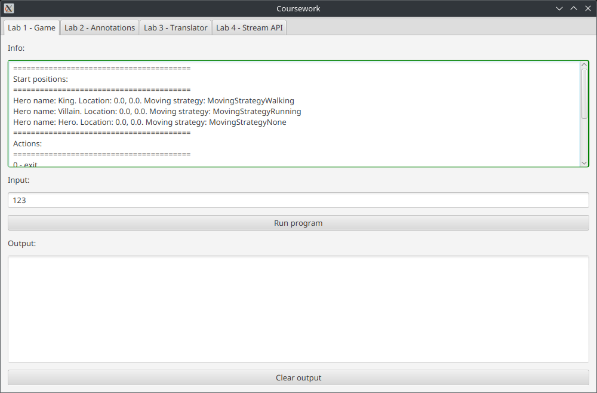

# politech-labs-java-oop

## 1. Описание

Лабораторные работы на Java и курсовая на JavaFX по предмету "ООП" (универ, 5-й семестр).

Изначально велись [тут](https://github.com/spbstu-java/labs-Nikolai2038) и [тут](https://github.com/spbstu-java/course-work-Nikolai2038).

## 2. Детали реализации

В качестве технологии для создания графического приложения курсовой работы, был выбран изученный в ходе лекций фреймворк JavaFX.
Разработка велась в IntelliJ IDEA с использованием Scene Builder для удобства настройки FXML-разметки.

Для каждой из лабораторных работ отведена отдельная вкладка внутри приложения.
На каждой из вкладок приведено поле вывода информации о работе, кнопка для запуска выполнения программы, и поле вывода информации о выполнении программы:



Вызов лабораторных работ происходит посредством вызова их скомпилированного файла. Данная логика описана в методе `runLab`:

```java
private void runLab(String className, String[] args, TextArea outputArea) {
    // Prepare the command to execute the class in a separate JVM
    List<String> command = new ArrayList<>();
    command.add("/home/nikolai/.jdks/openjdk-23/bin/java");
    command.add("-classpath");
    // Set the correct classpath where lab_x.Main classes are located
    command.add("./target/classes");
    // Class to be run
    command.add(className);
    Collections.addAll(command, args);

    // Start the process using ProcessBuilder
    ProcessBuilder processBuilder = new ProcessBuilder(command);
    Process process;
    try {
        process = processBuilder.start();
    } catch (IOException e) {
        showError("Error while starting lab process: " + e.getMessage());
        return;
    }

    // We will print both standard and error output in the same text
    StringBuilder outputTextBuilder = new StringBuilder();

    BufferedReader outReader = new BufferedReader(new InputStreamReader(process.getInputStream()));
    BufferedReader errReader = new BufferedReader(new InputStreamReader(process.getErrorStream()));

    try {
        String outLine;
        String errLine;
        do {
            // Capture the process's standard output
            outLine = outReader.readLine();
            if (outLine != null) {
                outputTextBuilder.append(outLine).append("\n");
            }
            // Capture any errors from the process's standard error
            errLine = errReader.readLine();
            if (errLine != null) {
                outputTextBuilder.append(errLine).append("\n");
            }
        } while (outLine != null || errLine != null);
    } catch (IOException e) {
        showError("Error while reading lab process standard output: " + e.getMessage());
        return;
    }
    // Wait for the process to exit
    int exitCode;
    try {
        exitCode = process.waitFor();
    } catch (InterruptedException e) {
        showError("Error while waiting for lab process to exit: " + e.getMessage());
        return;
    }
    // If exit code is not zero, change border color of the output box
    if (exitCode == 0) {
        outputArea.setStyle("-fx-background-color: green;");
    } else {
        outputArea.setStyle("-fx-background-color: red;");
    }

    outputArea.setText(outputTextBuilder.toString());
}
```

После вызова лабораторной работы, её стандартный вывод и вывод ошибок перехватываются и выводятся в соответствующее поле вывода.
Если произошла ошибка, поле вывода будет подсвечено красным цветом:


Если же выполнение прошло успешно – подсветка будет зелёной.

Для первой лабораторной работы было также добавлено поле для ввода действий.
После нажатия на кнопку запуска лабораторной, указанные действия будут переданы в программа первым аргументом, где он будет разбит на нужные действия:


```java
public static void main(String[] args) {
    if (Arrays.stream(args).toList().contains("--info")) {
        printInfo();
        System.exit(0);
    }

    if (args.length == 0) {
        System.out.println("Please enter your actions as string as first argument to the program.");
        System.exit(1);
    }

    String moves = args[0];

    if (moves.isEmpty()) {
        System.out.println("Please enter your actions as string as first argument to the program.");
        System.exit(1);
    }

    System.out.println("========================================");

    for_cycle:
    for (int i = 0; i < moves.length(); i++) {
        System.out.print("Your turn. Choose action: ");
        char command = moves.charAt(i);
        System.out.println(command);

        switch (command) {
            // ...
        }

        // ...
```

Для завершения графического приложения достаточно закрыть его окно.

### 2.1. Лабораторная работа 1

Пример вывода для лабораторной работы 1:


### 2.2. Лабораторная работа 2

Так как в лабораторной работе 2 количество вызовов для методов указываются в аннотации на этапе компиляции, дополнительных полей ввода тут добавлено не было.
Пример вывода для лабораторной работы 2:


### 2.3. Лабораторная работа 3

Для лабораторной работы 3 было добавлено поле для ввода путей к файлам словарей, а также поле для ввода текста для перевода.
Пример вывода для лабораторной работы 3:


### 2.4. Лабораторная работа 4

Для последней лабораторной работы были добавлены поля для ввода соответствующих списков с данными.
Введённые списки передаются в лабораторную работу строчками, где обрабатываются через операцию `split`:

```java
List<String> strings = Arrays.stream(args[1].split("\\s*,\\s*")).toList();
```

Для целочисленных список добавлена обработка исключения при преобразовании чисел:

```java
List<Integer> numbers;
try {
    numbers = Arrays.stream(args[0].split("\\s*,\\s*")).map(Integer::parseInt).toList();
} catch (NumberFormatException e) {
    System.out.println("Failed to convert string \"" + args[0] + "\" to list of integers!");
    System.exit(1);
    return;
}
```

Пример вывода для лабораторной работы 4:


